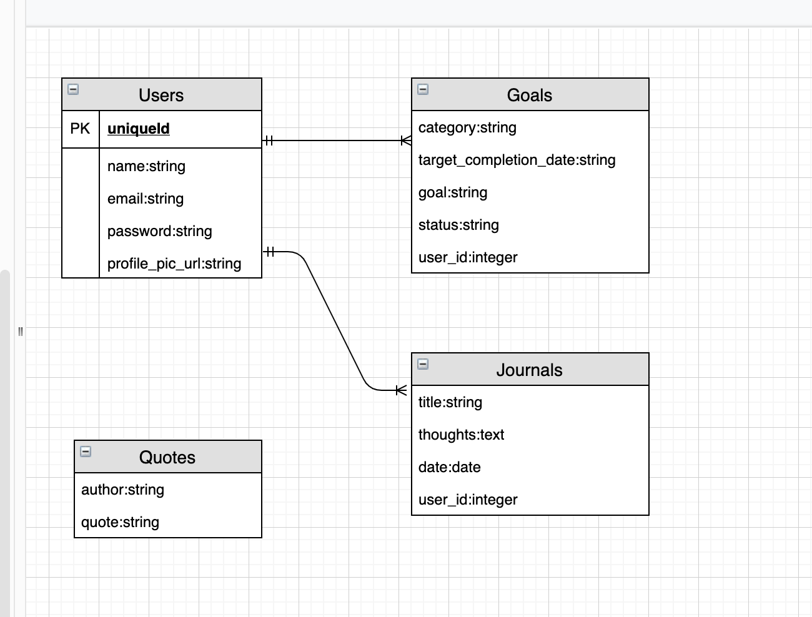
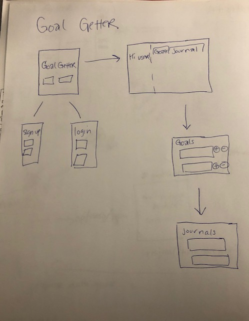

# Project 4: GoalGetter

## A PERN (Postgres, Express, React, Node) Stack application

## Links

Github Repo: 
Deployed link: `https://git.heroku.com/goalgetter-app.git`
Github links:
`https://github.com/llpatillo/goalgetter-frontend`
`https://github.com/llpatillo/goalgetter-backend`

## Technologies used:  

- __Command Line:__ Practice interacting with the computer and navigating the filesystem from the command line.
- __Source Control:__ Manage and interact with a git repository to store changes to code.
- __Programming Fundamentals:__ Work with objects, constructors, events, while learning how to strategically solve problems and resolve errors.
- __Web Fundamentals:__ Learn how communication happens over the internet, and how to structure, style, and animate documents within a browser. Also learn how to respond to actions your users take and the data they input into the browser.
- __Browser Applications:__ Dive into CSS, and figure out how to use libraries and frameworks to get lots of style and functionality for free.
- __Deployment:__ Host a web application in a managed hosting environment.
- __Responsive Web Design:__ Making web applications that respond to device size.
- __Server Side Applications:__ Server-side scripting is a technique used in web development which involves employing scripts on a web server which produce a response customized for each user's (client's) request to the website.
- __Databases:__ A structured set of data held in a computer, especially one that is accessible in various ways.
- __SQL:__ SQL is used to communicate with a database. It is the standard language for relational database management systems. SQL statements are used to perform tasks such as update data on a database, or retrieve data from a database.
- __AJAX:__ Using Axios to make asynchronous javascript calls.
- __APIs:__ Communicating to an API using Axios to fetch data.
- __Node:__ An open-source, cross-platform JavaScript run-time environment that executes JavaScript code outside of a browser.
- __NPM:__ A package manager for Node.js packages, or modules
- __PGAdmin:__ A manual user interface for PostgresSQL and derivative relational databases.
- __Postman:__ A collaborative platform for API development which helps to siplify wach step of building an API.  
- __React:__ A front end framework for building modern web applications.
- __Express:__ A minimal and flexible Node.js web application framework that provides a robust set of features for web and mobile applications.
- __JSON APIs:__ JSON (or JavaScript Object Notation) is a lightweight, easy and popular way to exchange data. A backend REST service to deliver some data in JSON format to the front-end application.

## Entity Relationship Diagram

## Wireframes

## User Stories
1.  As a user I want to be able to add and delete goals.
2.  As a user, I want to be able to add journal entries.  
3.  As a user I want to view all goals.
4.  As a user I want to see words of motivation.
5.  As a user I want to be able to check off goals as they are completed.
6.  As a user I want to recieve achievement awards as I complete goals.
7.  As a user I want to view past journal entries.
8.  As a user I want to receive tips on how to achieve goals.

